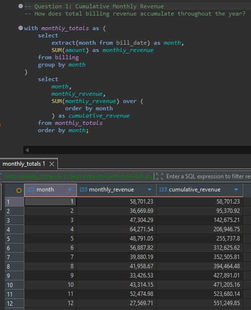
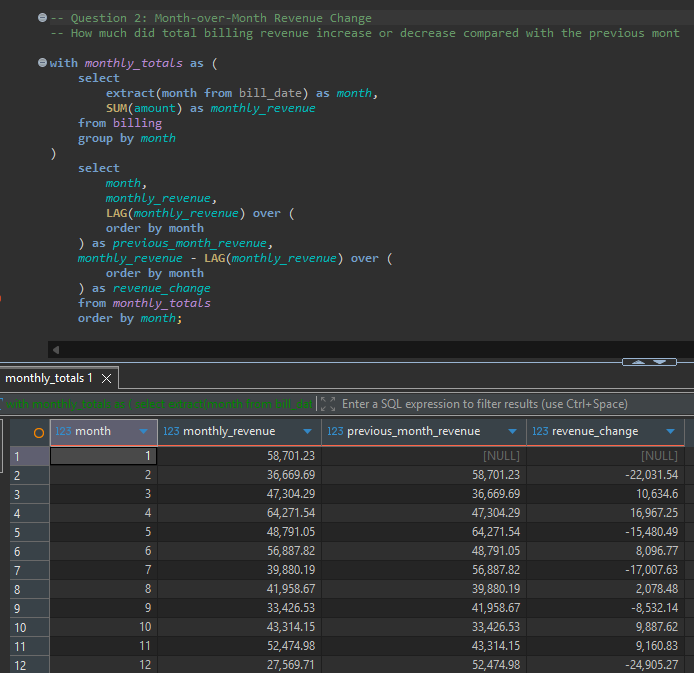
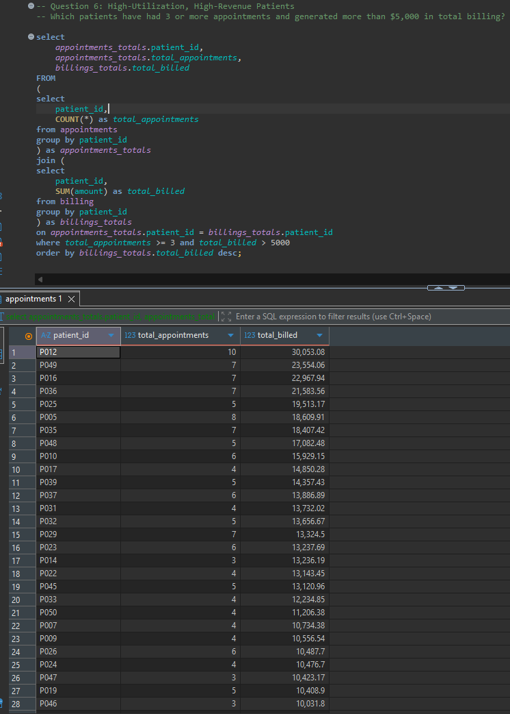
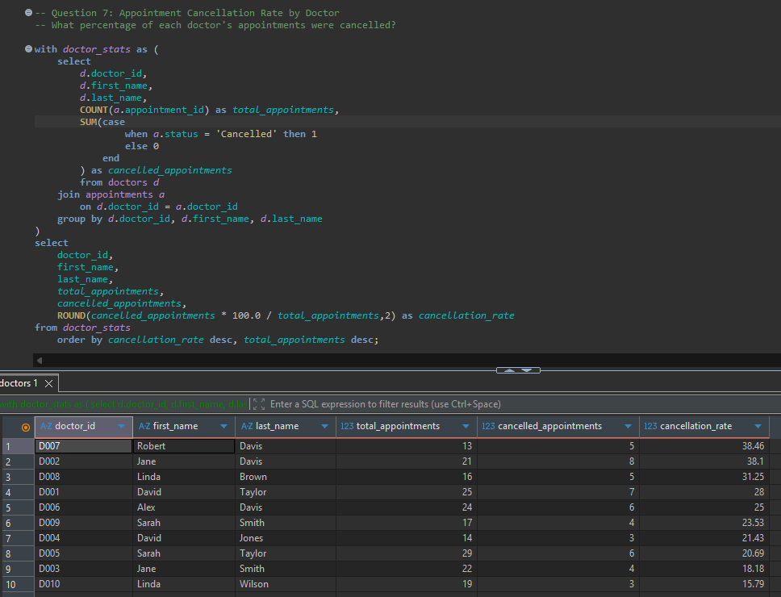

# Healthcare SQL Analysis

## Project Overview

This project uses PostgreSQL to analyze healthcare data across patients, doctors, appointments, treatments, and billing records.

The goal is to answer business-focused questions related to patient activity, hospital operations, treatment costs, and financial performance using SQL.

## Database

The project contains five relational tables:

- Patients
- Doctors
- Appointments
- Treatments
- Billing

The dataset contains 50 patients, 10 doctors, 200 appointments, 200 treatments, and 200 billing records.

## Analysis

The analysis is organized into five sections:

### 1. Data Exploration

Explores the overall structure and distribution of the healthcare data, including patient counts, appointment status, doctor workload, treatment volume, and monthly appointment activity.

### 2. Patient Analysis

Analyzes patient billing, insurance revenue, appointment frequency, treatment diversity, appointment cancellations, and patient utilization.

### 3. Hospital Operations

Analyzes doctor workload, appointment utilization, treatment volume, treatment revenue, and cancellation rates.

### 4. Financial Analysis

Analyzes revenue by payment method, insurance provider, treatment type, billing status, monthly revenue, and revenue collection rates.

### 5. Advanced Analysis

Uses more advanced SQL techniques to analyze cumulative revenue, month-over-month revenue changes, revenue growth, patient revenue per appointment, revenue rankings, doctor revenue performance, treatment cost rankings, and monthly revenue performance.

## SQL Skills Demonstrated

- SELECT statements
- Filtering and sorting
- GROUP BY and HAVING
- Aggregate functions
- INNER JOINs
- CASE statements
- Subqueries
- Common Table Expressions (CTEs)
- Window functions
- LAG
- RANK
- Date functions
- Revenue calculations
- Percentage calculations
- Month-over-month analysis
- Business-focused data analysis

## Project Structure

```text
Healthcare-SQL-Analysis/
├── README.md
├── data/
│   ├── README.md
│   ├── appointments.csv
│   ├── billing.csv
│   ├── doctors.csv
│   ├── patients.csv
│   └── treatments.csv
└── sql/
    ├── 01-data_exploration.sql
    ├── 02-patient_analysis.sql
    ├── 03-hospital_operations.sql
    ├── 04-financial_analysis.sql
    └── 05-advanced_analysis.sql
```
## Tools

- PostgreSQL
- DBeaver
- GitHub

## Data Source

The original dataset was obtained from the Kaggle Hospital Management Dataset by Kanak Baghel.

Hospital Management Dataset — Kaggle:
https://www.kaggle.com/datasets/kanakbaghel/hospital-management-dataset

The dataset is synthetic and was used as the source data for this analysis.

The original dataset is licensed under CC BY-SA 4.0. Attribution is provided to the original dataset author and source.

## Purpose

This project was created as a portfolio project to demonstrate practical SQL skills and the ability to use relational healthcare data to answer business-focused analytical questions.

## Analysis Screenshots

### Cumulative Monthly Revenue



### Month-over-Month Revenue Change



### High-Utilization, High-Revenue Patients



### Doctor Appointment Cancellation Rate


